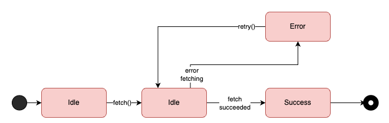

# SusStateMachine


SusStateMachine is a tiny kotlin multiplatform library to create simple yet powerful and robust finite state machines.
It is short for _**suspending state machine**_

The robustness lies in the fact that each must be implemented as a self-contained class, and can
only execute suspending code when the state is active. The way the StateMachine is implemented it
is impossible to have multiple active states. This eliminates all sorts of concurrency issues.

The way you have to set up the states of your state machine also helps to keep them readable.

## Gradle dependency

To use this library, just add the following dependency to your project.

```kotlin
implementation("io.github.hylkeb:susstatemachine:$version")
```

## Example

Consider the following simple finite state machine that describes the states of an API request.
This request will be exposed by one class, and can be re-used by multiple consumers.
The state machine makes sure only one actual call is being performed, and it makes it easy for concurrent consumers to reuse the state.



> Note: This example is also implemented in the tests of this library, see [RequestManager](./susstatemachine/src/commonTest/kotlin/io/github/hylkeb/susstatemachine/sample/RequestManager.kt).

### Implementing the states

In this example, the states will be defined using a sealed class, namely `RequestState`, which has to extend the `State<T : State>` class.

https://github.com/HylkeB/SusStateMachine/blob/main/susstatemachine/src/commonTest/kotlin/io/github/hylkeb/susstatemachine/sample/requeststate/RequestState.kt?plain=1#L5

Each state inherits of RequestState and is implemented in its own file to improve readability.
The following code shows some very simple implementation for each of the states.

As each state also implements the `State<T : State>` interface, they must implement the `suspend fun enter(): Transition<T>` method.
This function performs the work a state must do and then returns a transition towards a new state.
Sometimes the work a state must do is just wait for some external signal, and sometimes it can directly start its work as soon as its entered.

The `Transition` class describes a transition to a new toState.
It can optionally contain a reason a cause for troubleshooting.

https://github.com/HylkeB/SusStateMachine/blob/main/susstatemachine/src/commonTest/kotlin/io/github/hylkeb/susstatemachine/sample/requeststate/Idle.kt?plain=1#L10-L22

https://github.com/HylkeB/SusStateMachine/blob/main/susstatemachine/src/commonTest/kotlin/io/github/hylkeb/susstatemachine/sample/requeststate/Fetching.kt?plain=1#L8-L21

https://github.com/HylkeB/SusStateMachine/blob/main/susstatemachine/src/commonTest/kotlin/io/github/hylkeb/susstatemachine/sample/requeststate/Error.kt?plain=1#L10-L25

https://github.com/HylkeB/SusStateMachine/blob/main/susstatemachine/src/commonTest/kotlin/io/github/hylkeb/susstatemachine/sample/requeststate/Success.kt?plain=1#L8-L16

### Using the state machine

It's best to create a dedicated "Manager" class responsible for interacting with the StateMachine.
In this particular example we're defining a `RequestManager` class which is responsible for
providing the data associated with this request, or an error if it fails.
If multiple consumers request the data simultaneously, it should let every additional consumer piggyback on the already running request.

For this to happen, the `RequestManager` will instantiate a `StateMachine` and run it.

Furthermore, it will have one method called `suspend fun getResponse(): Result<String>`

> Note that the request itself is no longer bound to a particular consumer, but to some other lifecycle.
> This could be any lifecycle, for example just the lifecycle of the application altogether,
> or an arbitrary lifecycle such as the lifecycle of a logged in customer.
> Just make sure that the coroutine that runs the state machine is cancelled at the end.

https://github.com/HylkeB/SusStateMachine/blob/main/susstatemachine/src/commonTest/kotlin/io/github/hylkeb/susstatemachine/sample/RequestManager.kt?plain=1#L17-L59

Because the states are defined as a sealed class, it can perform exhaustive when statements,
always rigorously handling every case.

Furthermore, because the StateMachine can only be in one state at the same time, and the (suspending) logic happens in the enter method,
it also benefits from thread-safety. No matter how many concurrent `getResponse()` calls are being made, and potentially concurrent `fetch()` or `retry()`
calls are being made, it can always only result in one state transition, thus one active fetching state.

## Testability

### States

Each state is its own distinct class, with a very simple interface: an `enter()` method and possibly some external methods.
Even if a state is responsible for doing a lot of complex steps (e.g. fetching data, reading storage, writing storage),
with the proper DI infrastructure it is easy to test all of its transitions.

For example see how the Fetching state is tested.

https://github.com/HylkeB/SusStateMachine/blob/main/susstatemachine/src/commonTest/kotlin/io/github/hylkeb/susstatemachine/test/requeststate/FetchingUnitTest.kt?plain=1#L18-L59

Some states simply wait for an external signal before transitioning to a new state. 
In these cases, the consumer of the state machine (for example a manager class like RequestManager) 
is responsible for observing the stateFlow and waiting for the transition. 

This means that when a state transition is triggered by an external event, the consumer must ensure it waits for the resulting state change before proceeding.

### StateMachine managers

StateMachine manager classes (e.g., RequestManager) can be easily tested by mocking the StateMachine interface. 
You can stub stateFlow with your own prefilled states and verify that the consumer behaves correctly, 
without needing to mock every dependency of the individual states.

https://github.com/HylkeB/SusStateMachine/blob/main/susstatemachine/src/commonTest/kotlin/io/github/hylkeb/susstatemachine/test/RequestManagerUnitTest.kt?plain=1#L28-L135

## Observability

The `StateMachine` class optionally accepts a `stateMachineName` and a `StateObserver` and the `State` abstract class defines the property `State.name`.
Whenever a state transition is about to happen, the `StateObserver.stateTransition(..)` method is called.

The StateObserver is defined as following:

```kotlin
interface StateObserver {
    fun stateTransition(
        stateMachine: String, // name as provided when instantiating StateMachineImpl; defaults to "state-machine"
        fromState: String, // name of the state that just completed, defaults to State::class.simpleName.toString()
        toState: String, // name of the state that is about to be entered
        reason: String?, // the reason of the state transition, as defined in the Transition class
        cause: Throwable? // the cause of the state transition, as defined in the Transition class
    )
}
```

On purpose the state observer operates only on strings (and a Throwable), to discourage control flow based
on these events. This observer should only be used for troubleshooting.
